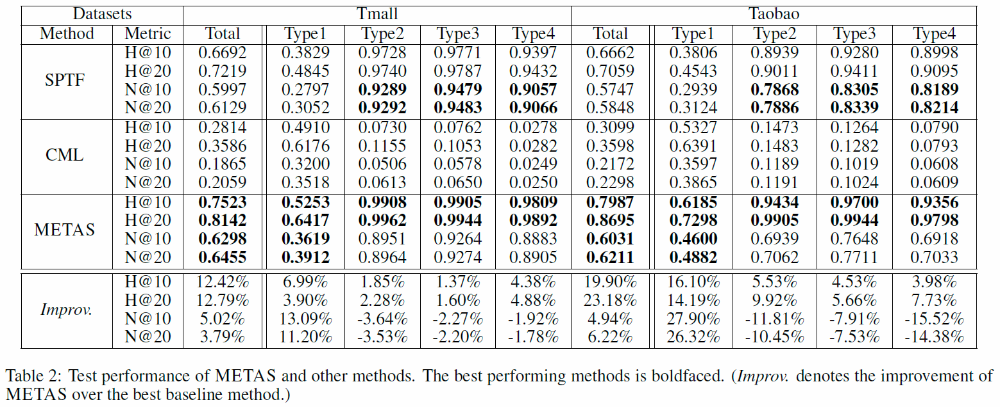

# Collaborative Metric Learning for User Behavior Prediction

This is a Tensorflow implementation for predicting users' future behaviors. The method is described in the paper ["Action Space Learning for Heterogeneous User Behavior Prediction"](https://www.ijcai.org/Proceedings/2019/392), presented at IJCAI 2019.

## Overview

Users’ behaviors observed in many web-based applications are usually heterogeneous, so modeling their behaviors considering the interplay among multiple types of actions is important. However, recent collaborative filtering (CF) methods based on a metric learning approach cannot learn multiple types of user actions, because they are developed for only a single type of user actions. This paper proposes a novel metric learning method, called METAS, to jointly model heterogeneous user behaviors. Specifically, it learns two distinct spaces: **1) action space** which captures the relations among all observed and unobserved actions, and **2) entity space** which captures high-level similarities among users and among items. Each action vector in the action space is computed using a non-linear function and its corresponding entity vectors in the entity space. In addition, METAS adopts an efficient triplet mining algorithm to effectively speed up the convergence of metric learning. Experimental results show that METAS outperforms the state-of-the-art methods in predicting users’ heterogeneous actions, and its entity space represents the user-user and item-item similarities more clearly than the space trained by the other methods.

<p align="center">

</p>

## Experimental Results

<p align="center">

</p>

## Running the Code
### Downloading user behavior datasets
We share the download links of the pre-processed datasets used for the experiments. The original T-mall dataset is provided by the paper ["SPTF: A Scalable Probabilistic Tensor Factorization Model for Semantic-Aware Behavior Prediction"](https://ieeexplore.ieee.org/document/8215531), and the original Taobao dataset is publicly available from [Ali Mobile Recommendation Algorithm Competition](https://tianchi.aliyun.com/dataset/dataDetail?dataId=46). Please untar and place the files in `./data/`.

* [T-mall](https://www.dropbox.com/s/ez8gyd2tfn3y0qr/tmall.tar.gz)
* [Taobao](https://www.dropbox.com/s/wca023w8m4extxs/taobao.tar.gz)

### Running

```
python main.py --dataset tmall --gpu True --gpu_devidx 0
```

### Arguments

Argument | Default | Description
--- | :---: | ---
`--n_embdims <int>` | 250 | The size of the entity embedding vectors
`--n_negsamples <int>` | 3 | The number of negative items per an observed action
`--n_updates <int>` | 5000000 | The number of updates
`--batch_size <int>` | 200 | The number of triplets in a mini-batch
`--display_step <int>` | 5000 | The display step
`--eval_at <int>` | 10 | The number of top-k items to be retrieved
`--alpha <float>` | 2.0 | The margin size for the triplet loss
`--learning_rate <float>` | 0.001 | The initial learning rate
`--dropout_prob <float>` | 0.5 | The dropout keep probability
`--gpu <bool>` | False | Enable to use GPU for training, instead of CPU
`--gpu_devidx <int>` | 0 | The device index of the target GPU (in case that multiple GPUs are available)

## Citation
If you use this code for your publication, please cite the original paper:
```
@inproceedings{lee2019action,
  title     = {Action Space Learning for Heterogeneous User Behavior Prediction},
  author    = {Lee, Dongha and Park, Chanyoung and Ju, Hyunjun and Hwang, Junyoung and Yu, Hwanjo},
  booktitle = {Proceedings of the Twenty-Eighth International Joint Conference on
               Artificial Intelligence, {IJCAI-19}},
  publisher = {International Joint Conferences on Artificial Intelligence Organization},             
  pages     = {2830--2836},
  year      = {2019}
}
```
